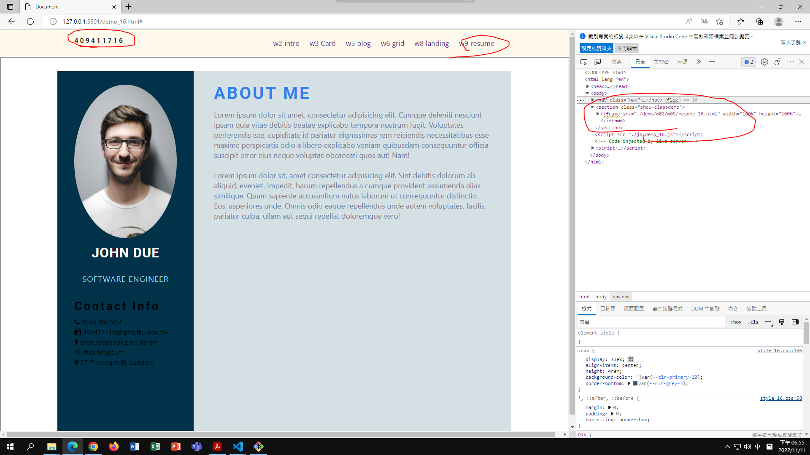

## Github & Vercel URL

[giturl](https://github.com/wurrrrrrrrrr/1111-web-demo-16)

[vercel url](https://1111-web-demo-16-g6mx.vercel.app/)

### W10-P1: show w09-resume locally



### W10-P2: show w09-resume from Vercel


### W10-P3: show w10_xx.md from Github


### W10-logs: show all logs of Week 9


```
$ git log --pretty=format:"%h%x09%an%x09%ad%x09%s" --after="2022-11-10"

```
