### w14-P1: file structures for final project

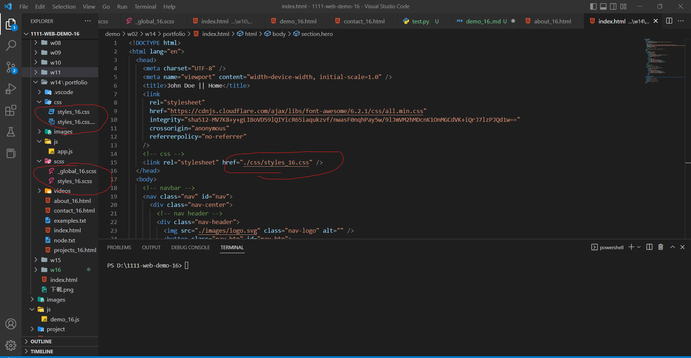

### w14-P2: social icons using global css, and custom css

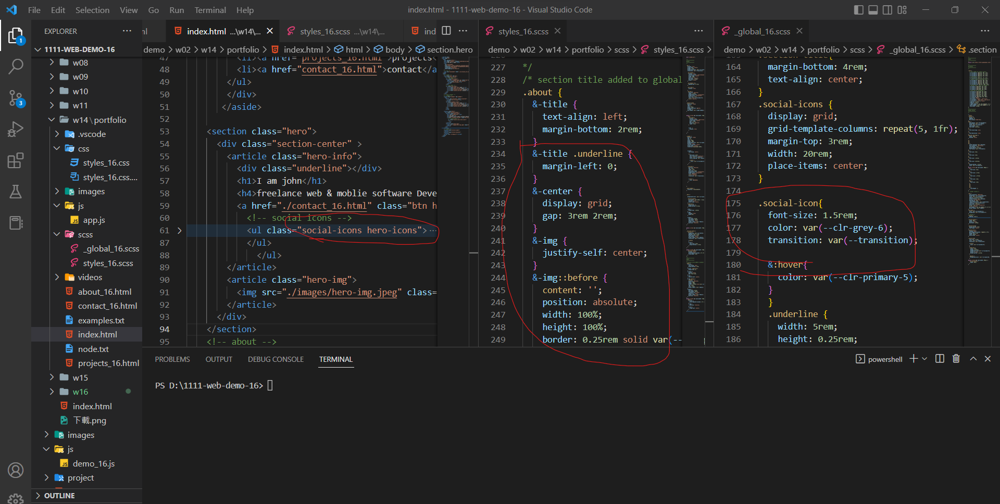

### w14-P3: Services section with responsive design with phone, pad and desktop computer

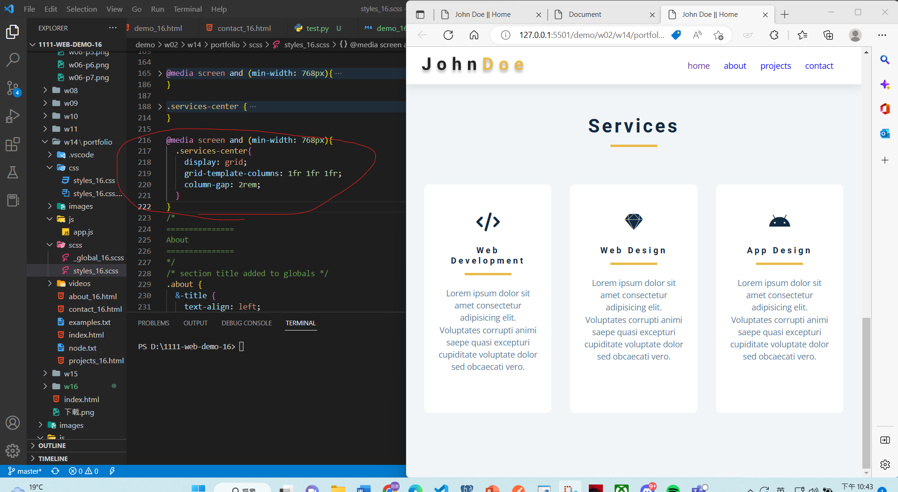

### w14-P4: finish About section with responsive design with phone, and desktop computer

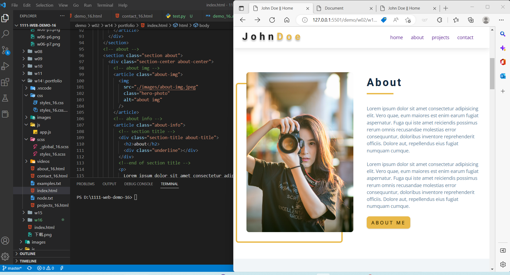
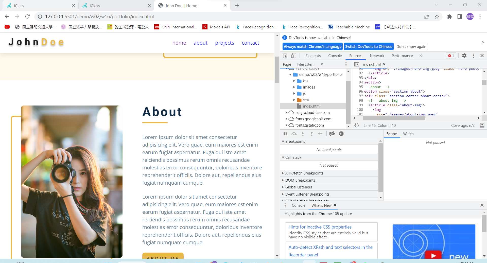

## Github & Vercel URL

[giturl](https://github.com/wurrrrrrrrrr/1111-web-demo-16)

[vercel url](https://1111-web-demo-16-g6mx.vercel.app/)

### w15-P1:nav link to about page with navbar and footer

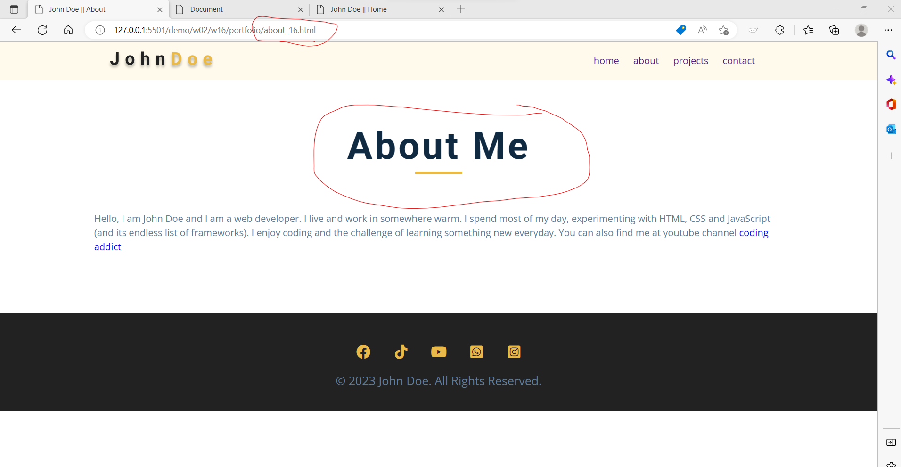
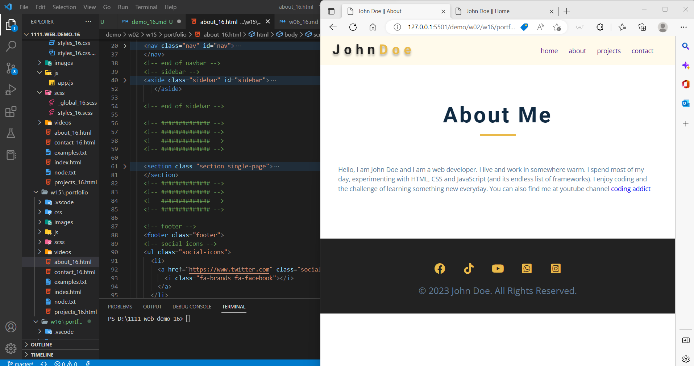

### w15-P2: Latest works using grid-template-areas

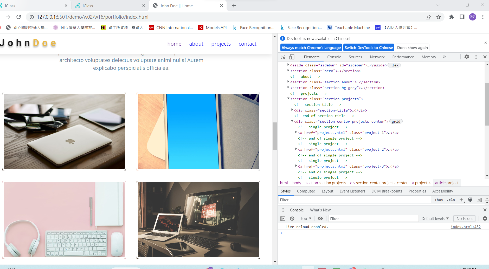
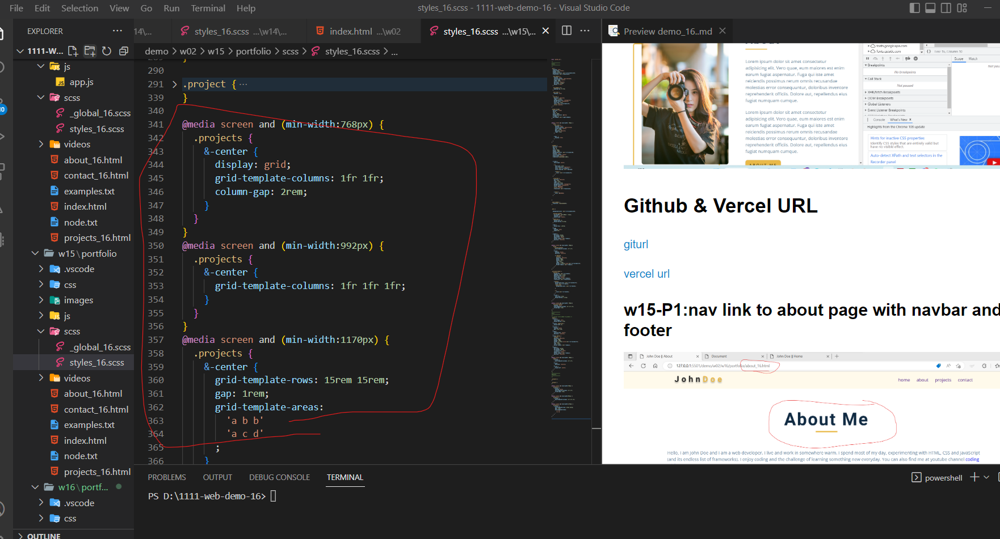

### w16-P1: show how to show odd number timeline

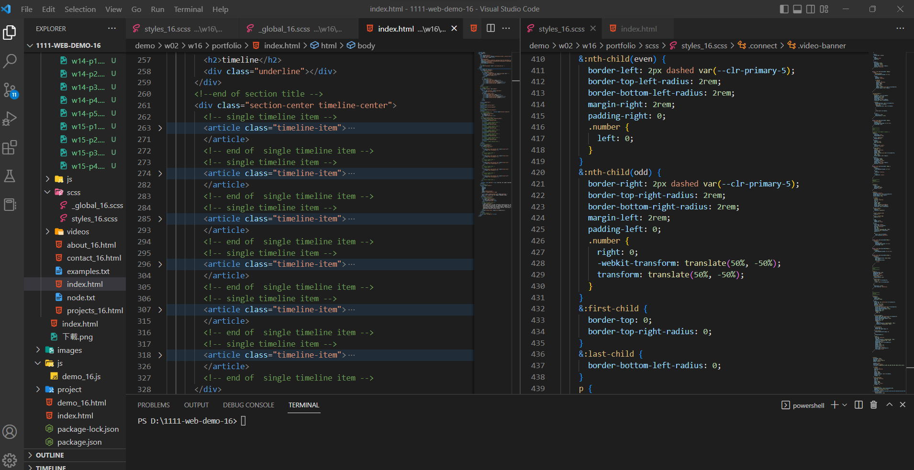

### w16-P2:connect section using clip-path

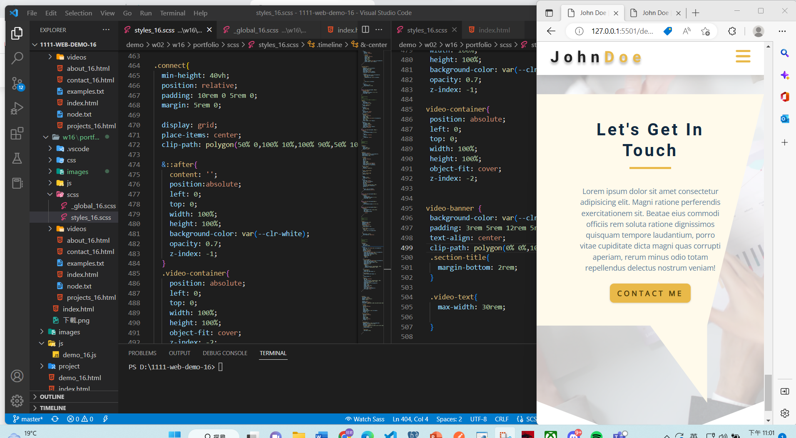

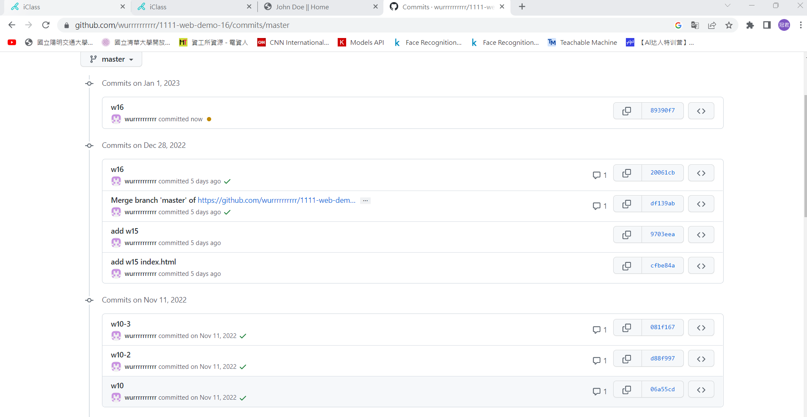
